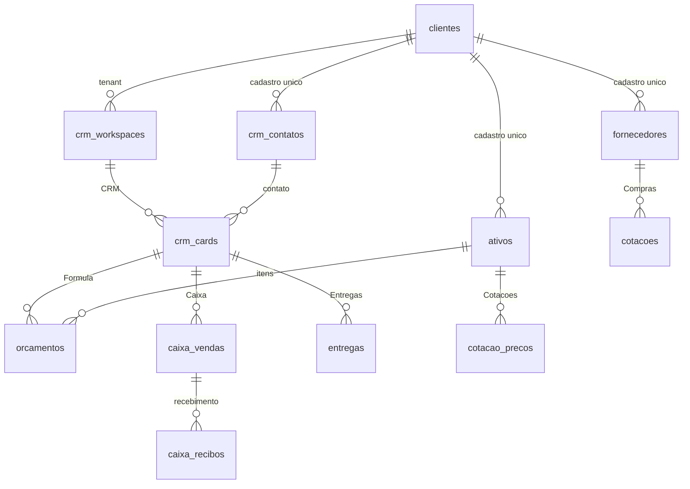
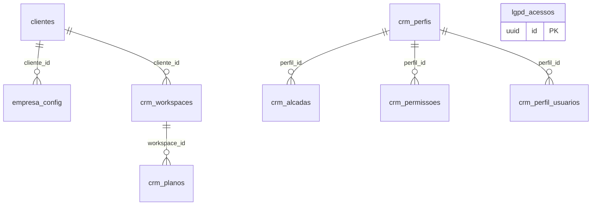
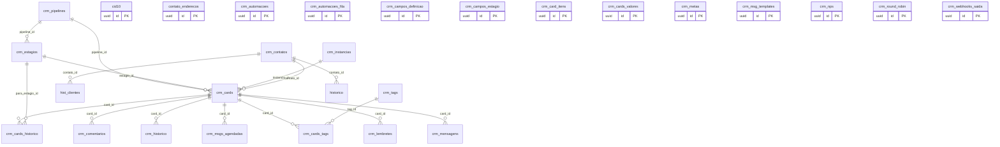
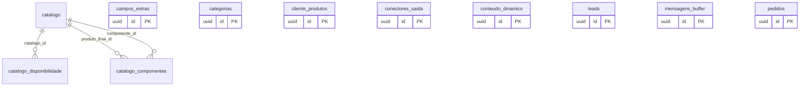
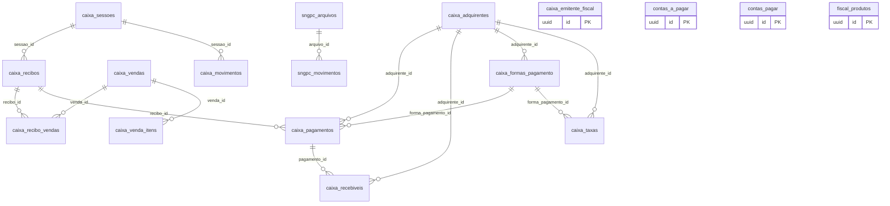
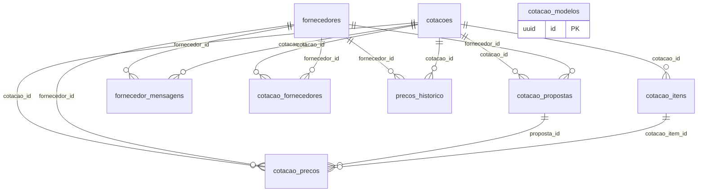
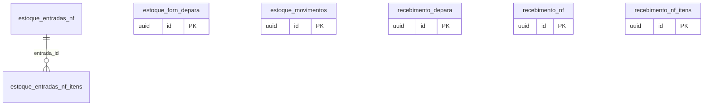
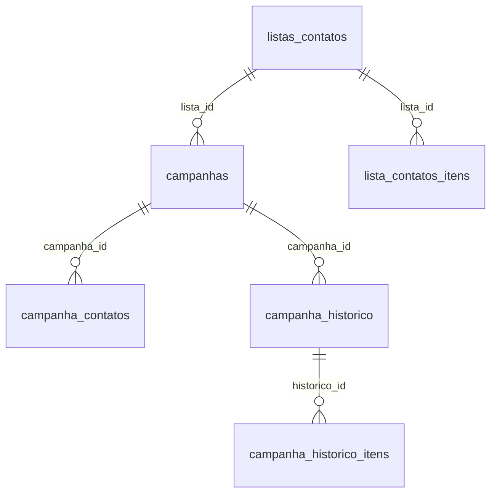
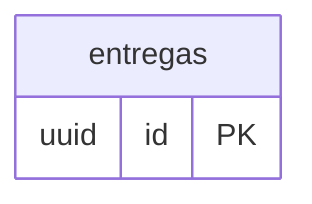

# Modelo de Dados (MER)

Ecossistema **multi-tenant** no Supabase/PostgreSQL: **116 tabelas** e **154 relações (FK)**. Tudo pertence a um **cliente** (tenant); os cadastros de **ativos**, **fornecedores** e **contatos** são únicos e compartilhados entre os módulos. **Clique em qualquer diagrama para ampliar** (zoom).

## Hubs (mais referenciados)

| Tabela | FKs que apontam p/ ela | Papel |
| --- | --- | --- |
| clientes | 39 | Tenant — tudo pertence a um cliente |
| crm_workspaces | 15 | Espaço de trabalho do CRM (por negócio) |
| ativos | 13 | Cadastro único de matéria-prima |
| fornecedores | 9 | Cadastro único de fornecedor |
| crm_cards / crm_contatos | 7 | Card do atendimento / contato único |

## Visão geral (hubs & módulos)

## Núcleo — Tenant & Acesso  (9 tabelas)

**Liga-se a (outros módulos):** `conectores_saida`

## CRM  (28 tabelas)

**Liga-se a (outros módulos):** `clientes`, `crm_workspaces`

## Agente / Catálogo  (11 tabelas)

**Liga-se a (outros módulos):** `clientes`, `crm_contatos`

## Fórmula / Lab (manipulação)  (28 tabelas)

```mermaid
erDiagram
  hist_formulas ||--o{ hist_formulas_itens : "formula_id"
  lab_formulas_padrao ||--o{ lab_formulas_padrao_itens : "formula_id"
  ativos ||--o{ lab_formulas_padrao_itens : "ativo_id"
  orcamentos ||--o{ lab_ordens : "orcamento_id"
  prescritores ||--o{ lab_ordens : "prescritor_id"
  lab_etapas ||--o{ lab_ordens : "etapa_id"
  ativos ||--o{ lab_lotes_mp : "ativo_id"
  lab_lotes_mp ||--o{ lab_lotes_mp : "lote_puro_id"
  lab_lotes_mp ||--o{ lab_laudo_ensaios : "lote_id"
  ativos ||--o{ ativos : "ativo_puro_id"
  lab_ordens ||--o{ lab_rotulos : "ordem_id"
  lab_rotulo_templates ||--o{ lab_rotulos : "template_id"
  orcamentos ||--o{ receita_logs : "orcamento_id"
  lab_lotes_mp ||--o{ lab_laudos : "lote_id"
  lab_ordens ||--o{ lab_ordem_itens : "ordem_id"
  ativos ||--o{ lab_ordem_itens : "ativo_id"
  lab_lotes_mp ||--o{ lab_ordem_itens : "lote_mp_id"
  ativos ||--o{ lab_producoes_internas : "ativo_id"
  lab_lotes_mp ||--o{ lab_producoes_internas : "lote_gerado_id"
  lab_lotes_mp ||--o{ lab_producoes_internas : "lote_puro_id"
  ativos ||--o{ lab_producoes_internas : "veiculo_ativo_id"
  lab_lotes_mp ||--o{ lab_producoes_internas : "lote_veiculo_id"
  formas_farmaceuticas ||--o{ orcamentos : "forma_id"
  prescritores ||--o{ orcamentos : "prescritor_id"
  lab_ordens ||--o{ lab_ordem_etapas : "ordem_id"
  ativo_precos_hist {
    uuid id PK
  }
  ativos_sinonimos {
    uuid id PK
  }
  lab_inventario {
    uuid id PK
  }
  lab_inventario_itens {
    uuid id PK
  }
  lab_producao {
    uuid id PK
  }
  lab_producao_itens {
    uuid id PK
  }
  laudo_modelos {
    uuid id PK
  }
  tipos_capsula {
    uuid id PK
  }
  unidades_medida {
    uuid id PK
  }
```

**Liga-se a (outros módulos):** `clientes`, `crm_contatos`, `fornecedores`, `hist_clientes`

## Caixa / Financeiro / Fiscal  (17 tabelas)

**Liga-se a (outros módulos):** `ativos`, `clientes`, `estoque_entradas_nf`, `fornecedores`

## Cotações (compras)  (9 tabelas)

**Liga-se a (outros módulos):** `ativos`, `clientes`

## Estoque  (7 tabelas)

**Liga-se a (outros módulos):** `ativos`, `clientes`, `fornecedores`, `lab_lotes_mp`

## Campanhas  (6 tabelas)

**Liga-se a (outros módulos):** `clientes`, `crm_instancias`

## Entregas  (1 tabelas)

